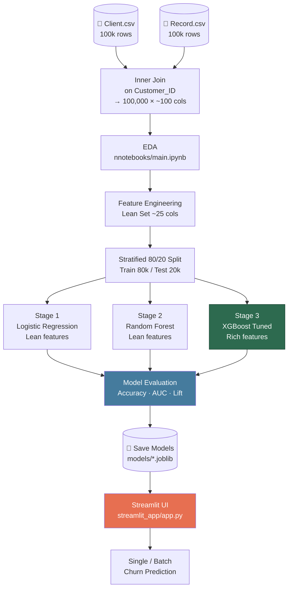

# Diagram: Overall Project Pipeline

This diagram shows the end-to-end flow of the entire project, from raw data to deployment.

**Key points:**
- Both CSV files are joined on `Customer_ID` before any analysis.
- EDA informs which features to engineer and which to drop.
- Three model stages are trained on the same 80/20 split for fair comparison.
- Only the final XGBoost model is deployed in the Streamlit UI.
