# Diagram: Feature Engineering Pipeline

This diagram shows the step-by-step feature engineering process from raw joined data to the model-ready matrix.

```mermaid
flowchart TD
    A["Raw Joined Table\n100,000 × ~100 cols"]

    subgraph CLEAN ["Step 1 — Quality Fixes"]
        B1["Drop Customer_ID\n(leakage prevention)"]
        B2["Floor eqpdays ≥ 0\n(domain constraint)"]
    end

    subgraph DERIVE ["Step 2 — Derived Features"]
        C1["mou_decline_flag\n= 1 if change_mou < 0"]
        C2["overage_ratio\n= ovrrev_Mean / (|totmrc_Mean| + ε)"]
    end

    subgraph SELECT ["Step 3 — Feature Selection"]
        D1["17 Numeric Features\neqpdays, hnd_price, months,\nmou_Mean, rev_Mean,\nchange_mou, change_rev, …"]
        D2["8 Categorical Features\nasl_flag, creditcd, area,\nprizm_social_one,\ndualband, hnd_webcap, …"]
        D3["❌ Dropped\nSparse demographics\n(numbcars, dwllsize, …)\nRedundant MOU windows\n(totmou, avgmou, avg6mou, …)"]
    end

    subgraph SPLIT ["Step 4 — Train/Test Split"]
        E1["Train Set\n80,000 rows\nstratify=y, random_state=42"]
        E2["Test Set\n20,000 rows\nheld out until evaluation"]
    end

    subgraph PREP ["Step 5 — Preprocessing (train-only fit)"]
        F1["Winsorize tails\nchange_mou, change_rev,\noverage_ratio\n(1st–99th pct on TRAIN only)"]
        F2["ColumnTransformer\nNumerics: MedianImputer\nCategoricals: 'Missing' + OneHotEncoder"]
        F3["LR branch only\n+ StandardScaler"]
    end

    G["Model-Ready Matrix\n~63 columns after OHE"]

    A --> CLEAN
    CLEAN --> DERIVE
    DERIVE --> SELECT
    SELECT --> SPLIT
    SPLIT --> PREP
    PREP --> G
```

**Lean vs Rich Feature Sets:**

| Set | Used in | Extra features added |
|-----|---------|----------------------|
| Lean (~25 cols) | Stage 1 LogReg, Stage 2 RF | — |
| Rich (~35+ cols) | Stage 3 XGBoost | `eqpdays_x_change_mou`, `mou_per_month`, `rev_per_mou`, `drop_rate`, `care_per_mou`, `eqpdays_bin`, `avg6mou`, `avgrev`, `complete_Mean`, `attempt_Mean`, `roam_Mean`, `marital`, `ethnic` |
