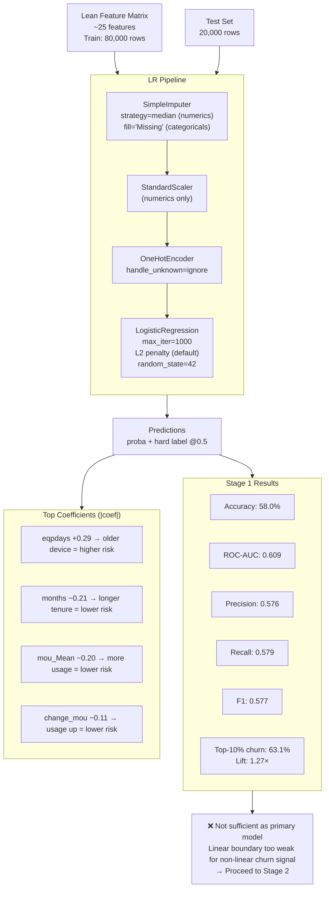

# Diagram: Stage 1 — Logistic Regression (Baseline)

**Why this stage was not enough:**
- Accuracy is only ~8 points above a random 50/50 guess.
- EDA showed max linear `|r|` with churn ≈ 0.11 — linear models are fundamentally limited here.
- Churn relationships involve interactions (e.g. old handset **and** usage drop together), which logistic regression cannot easily capture.
- AUC 0.609 means the model ranks churners only slightly better than random.
