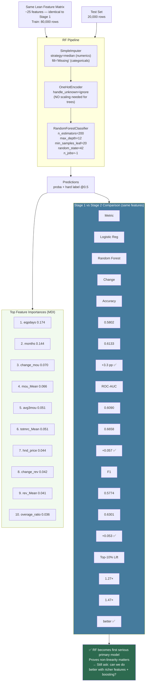

# Diagram: Stage 2 — Random Forest (First Upgrade)

**Key insight from Stage 2:**
- RF beat LR on **every metric** using the **exact same features** — this proves the gain comes from the algorithm (non-linear trees), not from adding new data.
- Feature importances aligned perfectly with EDA findings: `eqpdays`, `months`, `change_mou` are the top drivers.
- ~61% accuracy still felt low for a headline score → motivated Stage 3 with richer features + gradient boosting.
