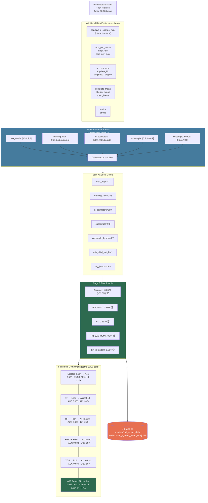

# Diagram: Stage 3 — XGBoost Tuned (Final Model)

**Total gain from Stage 1 → Stage 3:**

| Metric | Stage 1 (LogReg) | Stage 3 (XGB Tuned) | Gain |
|--------|-----------------|---------------------|------|
| Accuracy | 0.580 | **0.633** | **+5.3 pp** |
| ROC-AUC | 0.609 | **0.689** | **+0.080** |
| Top-10% Lift | 1.27× | **1.58×** | **+0.31×** |
