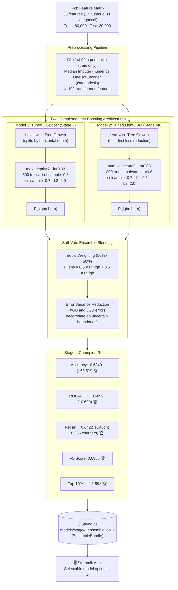

# Diagram: Stage 4 — Soft-Vote Ensemble (XGBoost + LightGBM)

This diagram shows the architecture and workflow of the Stage 4 Soft-Vote Ensemble, combining level-wise XGBoost and leaf-wise LightGBM into the project's highest-performing churn prediction model.

### Full Evolution Summary Across All 4 Stages

| Metric | Stage 1 (LogReg) | Stage 2 (Random Forest) | Stage 3 (XGBoost) | Stage 4 (Ensemble) | Total Gain (1 → 4) |
|---|:---:|:---:|:---:|:---:|:---:|
| **Features Used** | Lean (~25) | Lean (~25) | Rich (~38) | **Rich (~38)** | — |
| **Accuracy** | 0.5802 | 0.6133 | 0.6327 | **0.6349** | **+5.5 pp** |
| **ROC-AUC** | 0.6090 | 0.6658 | 0.6889 | **0.6899** | **+0.081** |
| **Recall (Churners)** | 0.5786 | 0.6645 | 0.6392 | **0.6422** | **+0.064** |
| **F1-Score** | 0.5774 | 0.6301 | 0.6330 | **0.6355** | **+0.058** |
| **Top-10% Lift** | 1.27× | 1.47× | 1.58× | **1.59×** | **+0.32×** |

### Why This Stage Was Added
1. **Architectural Diversity**: XGBoost splits level-by-level; LightGBM splits leaf-by-leaf. They learn slightly different decision boundaries on the same features.
2. **Variance Reduction**: Blending two high-performing probability distributions reduces noise and smooths probability calibration.
3. **Seamless Deployment**: Wrapped in `EnsembleBundle` inside [`models/stage4_ensemble.joblib`](../models/stage4_ensemble.joblib), making it instantly runnable in the Streamlit UI.
